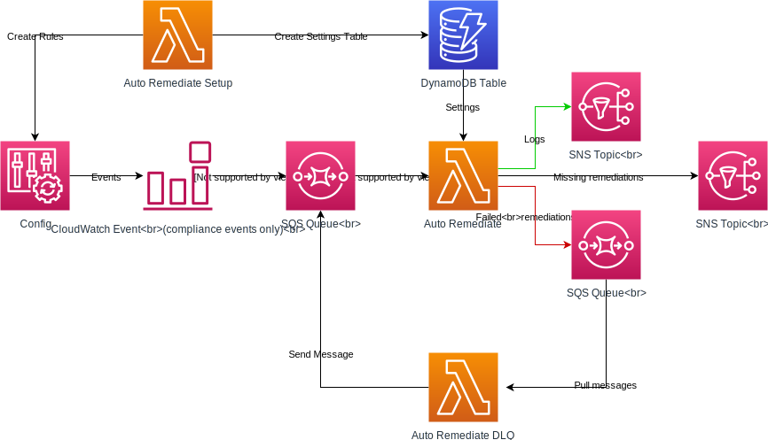

# AWS Auto Remediate

    [](https://www.codacy.com/app/servian/aws-auto-remediate?utm_source=github.com&amp;utm_medium=referral&amp;utm_content=servian/aws-auto-remediate&amp;utm_campaign=Badge_Grade) [](https://github.com/python/black)

Open source application to instantly remediate common security issues through the use of AWS Config.



## Table of Contents

- [About](#about)
- [Setup](#setup)
- [Settings](#settings)
- [Resources](#resources)
- [Config Rules](#config-rules)

## About

### Auto Remediate

The Auto Remediate function is triggered via an SQS Queue `auto-remediate-config-compliance`. The SQS Queue is populated with a compliance payload from AWS Config via a CloudWatch Event `auto-remediate-config-compliance`. The purpose of the CloudWatch Event is to filter out all non-compliance related messages that AWS Config generates.

Once the Lambda function has been triggered it will attempt to remediate the security concern. If the remediation was unsuccessful, the event payload will be sent to the dead letter queue (DQL) SQS Queue `auto-remediate-dlq`. Each time a payload is sent is sent to the DLQ, an attribute `try_count` is incremented to the SQS message. Once that count exceeds `RETRYCOUNT` variable attached to the Lambda Function, the message will no longer be sent to the DLQ.

### Auto Remediate DLQ

The Auto Remediate DLQ function is triggered on a schedule (defined in the `serverless.yml` file). When the function is run, it will retrieve messages from SQS Queue `auto-remediate-dlq` and sends the message to the compliance SQS Queue `auto-remediate-config-compliance`.

### Auto Remediate Setup

The Auto Remediate Setup function is triggered manually by the user. The purpose of this function is to invoke CloudFormation Stacks for each of the AWS Config Rules that will monitor for security issues as well as create/insert records into the DynamoDB settings table used to control the actions of the Auto Remediate function.

## Setup

### New Account

Proceed to the [Deployment](#deployment) section below.

### Existing Account

Auto Remediate utilises the compliance event triggers made by AWS Config. Due to the fact that AWS Config will trigger a compliance event **only** when the compliance status of a resource changes state (i.e., COMPLIANT to NON_COMPLIANT or vice versa) it is advised that you **disabled** the `CIS AWS Foundations` compliance standards within AWS Security Hub (and ensure all AWS Config rules starting with `securityhub` are removed from your account) before proceeding.

Once AWS Config is cleared of all AWS Security Hub related rules, you may proceed to deploy Auto Remediate and enable the `CIS AWS Foundations` compliance standards within AWS Security Hub.

### Deployment

To deploy Auto Remediate to your AWS account, follow the below steps:

01. Install Serverless

```bash
npm install serverless -g
```

02. Install AWS CLI

```bash
pip3 install awscli --upgrade --user
```

03. Clone this repository

```bash
git clone https://github.com/servian/aws-auto-remediate
```

04. Configure AWS CLI following the instruction at [Quickly Configuring the AWS CLI](https://docs.aws.amazon.com/cli/latest/userguide/cli-chap-configure.html#cli-quick-configuration). Ensure the user you're configuring has the appropriate IAM permissions to create Lambda Functions, S3 Buckets, IAM Roles, and CloudFormation Stacks. It is best for administrators to deploy Auto Remediate.

05. If you've configure the AWS CLI using a profile, open the `serverless.yml` file and modify the `provider > profile` attribute to match your profile name.

06. Change the custom `company` attribute within the `serverless.yml` file to your company name in order to prevent S3 Bucket name collision

07. Change into the Auto Remediate directory

```bash
cd aws-auto-remediate
```

08. Install Serverless plugins

```bash
serverless plugin install -n serverless-python-requirements
```

```bash
npm install serverless-iam-roles-per-function
```

09. Deploy Auto Remediate

```bash
serverless deploy
```

10. Invoke Auto Remediate Setup for the first time to create the necessary AWS Config rules and Settings

```bash
serverless invoke -f AutoRemediateSetup
```

11. Check Auto Remediate Setup logs

```bash
serverless logs -f AutoRemediateSetup
```

### Removal

Auto Remediate is deployed using the Serverless Framework which under the hood creates an AWS CloudFormation Stack. This means removal is clean and simple.

To remove Auto Remediate from your AWS account, follow the below steps:

1. Change into the Auto Remediate directory

```bash
cd aws-auto-remediate
```

2. Remove Auto Remediate

```bash
serverless remove
```

## Settings

Auto Remediate uses a DynamoDB settings table `auto-remediate-settings` that allows the user to control which rule should be remediated by the tool. Once Auto Remediate Setup has been run, head on over to DynamoDB and inspect the `rules` key where you can then set the `remediate` key to `false` if you'd like to disable automatic remediate.

For rules deployed by Auto Remediate Setup `auto-remediate-rds-instance-public-access-check` an extra key `deploy` can be found in the settings table. Although not functional at the moment, this will allow users to control which Auto Remediate deployed rules should be deployed and which should be skipped.

## Resources

The table below details all AWS resources created when deploying the application.

| Service               | Resource ID                        |
| --------------------- | ---------------------------------- |
| CloudFormation Stack  | `auto-remediate`                   |
| CloudWatch Event Rule | `auto-remediate-config-compliance` |
| DynamoDB Table        | `auto-remediate-settings`          |
| Lambda Function       | `auto-remediate`                   |
|                       | `auto-remediate-dlq`               |
|                       | `auto-remediate-setup`             |
| SNS Topic             | `auto-remediate-log`               |
| SQS Queue             | `auto-remediate-config-compliance` |
|                       | `auto-remediate-dlq`               |

## Config Rules

The tables below detail the auto remediated rules and scenarios.

### AWS Config Managed Rules

#### Database

| Rule                                                         |
| :----------------------------------------------------------- |
| [rds-instance-public-access-check](https://docs.aws.amazon.com/config/latest/developerguide/rds-instance-public-access-check.html)<br />Check whether the Amazon Relational Database Service instances are not publicly accessible. The rule is NON_COMPLIANT if the `publiclyAccessible` field is true in the instance configuration item. |

### AWS Security Hub Rules

#### Compute

| Rule                                                         |
| :----------------------------------------------------------- |
| **securityhub-restricted-rdp**<br />Checks whether the incoming RDP traffic is Allowed from 0.0.0.0/0. This rule is compliant when incoming RDP traffic is restricted. |
| **securityhub-restricted-ssh**<br />Checks whether the incoming SSH traffic for the security groups is accessible. The rule is compliant when the IP addresses of the incoming SSH traffic in the security groups are restricted. This rule applies only to IPv4. |

#### Network and Content Delivery

| Rule                                                         |
| :----------------------------------------------------------- |
| **securityhub-vpc-flow-logs-enabled**<br />Checks whether Amazon Virtual Private Cloud flow logs are found and enabled for Amazon VPC.<br /><br />:warning: **WARNING:** The remediation process will create a new S3 Bucket with the format: `<bucket_name>-flow-logs`. |

#### Security, Identity & Compliance

| Rule                                                         |
| :----------------------------------------------------------- |
| **securityhub-access-keys-rotated** (NOT IMPLEMENTED)<br />Checks whether the active access keys are rotated within the number of days specified in 90 days. |
| **securityhub-cmk-backing-key-rotation-enabled**<br />Checks that key rotation is enabled for customer created customer master key (CMK). |
| **securityhub-iam-password-policy-ensure-expires**<br /> Checks whether the IAM password policy ensures that passwords expire. |
| **securityhub-iam-password-policy-lowercase-letter-check**<br /> Checks whether the IAM password policy enforces the inclusion of a lowercase letter. |
| **securityhub-iam-password-policy-minimum-length-check**<br /> Checks whether the IAM password policy enforces a minimum length. |
| **securityhub-iam-password-policy-number-check**<br /> Checks whether the IAM password policy enforces the inclusion of a number . |
| **securityhub-iam-password-policy-prevent-reuse-check**<br /> Checks whether the IAM password policy prevents password reuse. |
| **securityhub-iam-password-policy-symbol-check**<br /> Checks whether the IAM password policy enforces the inclusion of a symbol. |
| **securityhub-iam-password-policy-uppercase-letter-check**<br />Checks whether the account password policy for IAM users requires at least one uppercase character in password. |
| **securityhub-iam-user-unused-credentials-check**<br />Checks whether AWS Identity and Access Management (IAM) users have passwords or active access keys that have not been used within 90 days.<br /><br />:warning: **WARNING:** Access/Secret Keys and Login Profiles for identified users will be deleted during the remedtion process. This could have unforeseen consequences for your users or service accounts. |

#### Storage

| Rule                                                         |
| :----------------------------------------------------------- |
| **securityhub-s3-bucket-logging-enabled**<br />Checks whether logging is enabled for your S3 buckets.<br /><br />⚠️ **WARNING:** The remediation process will create a new S3 Bucket with the format: `<bucket_name>-access-logs`. |
| **securityhub-s3-bucket-public-read-prohibited**<br />Checks to see if S3 buckets are publicly readable. |
| **securityhub-s3-bucket-public-write-prohibited**<br />Checks to see if S3 buckets allow public write. |